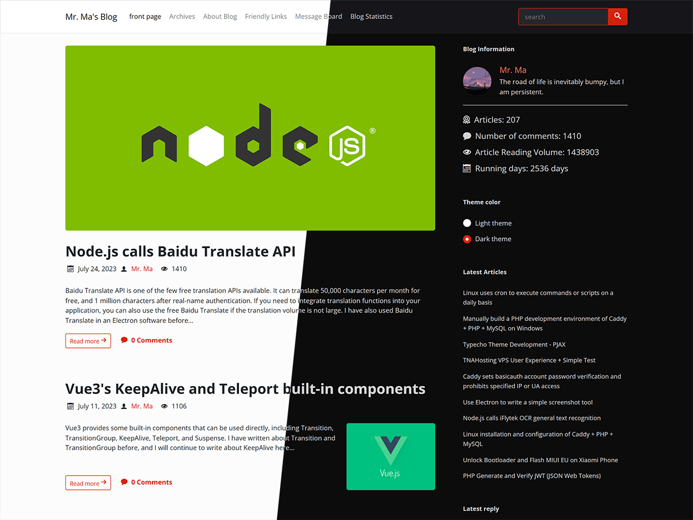
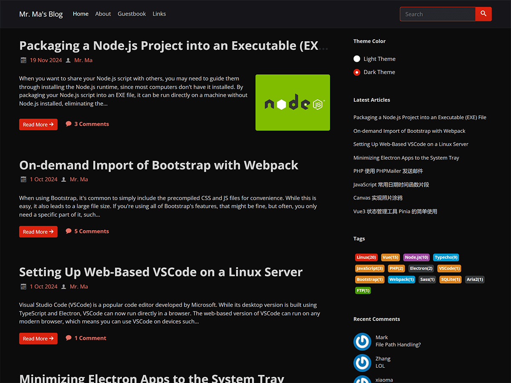
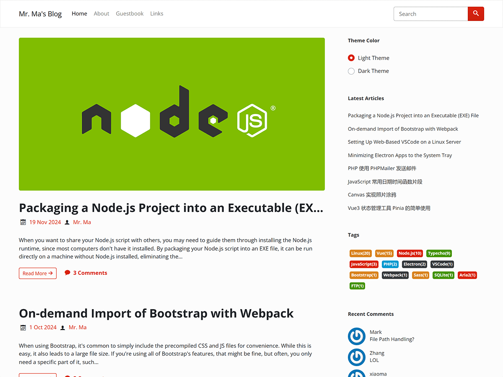

# Facile-WordPress

[English](README.md) | [简体中文](README.zh.md) | **日本語** | [Español](README.es.md)

Facile は、WordPress と Typecho の両方に対応した、シンプルでミニマルなブログテーマです。私自身のブログでも使用しています。

現在ご覧になっているのは WordPress 版のテーマです。Typecho 版をお探しの場合は、[https://github.com/changbin1997/Facile](https://github.com/changbin1997/Facile) をご覧ください。

## 関連リンク

テーマのデモ: [https://www.misterma.com/](https://www.misterma.com/)

テーマのダウンロード: [https://github.com/changbin1997/facile-wordpress/releases](https://github.com/changbin1997/facile-wordpress/releases)

利用ガイド: [https://www.misterma.com/archives/952/](https://www.misterma.com/archives/952/)

テーマの使用中に問題やバグが発生した場合は、[私のブログ](https://www.misterma.com/archives/952/) にコメントを残すか、[GitHub Issues](https://github.com/changbin1997/facile-wordpress/issues) に報告してください。

## スクリーンショット

ライトテーマ:

ダークテーマ:

大:

## 特徴

* すべてのデバイスで快適に閲覧できるレスポンシブデザイン
* すべてのユーザーに快適な体験を提供するアクセシビリティ対応
* システム設定に合わせて自動調整されるライト・ダークの配色
* 開発者や技術好きな方にうれしいコードハイライト機能を内蔵
* MathJax による数式のレンダリングに対応
* 多彩なレイアウトに対応した記事リスト
* 好みに合わせてカスタマイズできる豊富な設定項目
* セットアップと使い方を解説する詳細な[ドキュメント](https://www.misterma.com/archives/952/)
* 長期的な安定性のために積極的にメンテナンス

## インストール

WordPress の公式テーマディレクトリはテーマ開発に厳しい要件を設けているため、現在このテーマもそのガイドラインに合わせて調整中です。調整が完了し次第、公式テーマディレクトリに登録される予定です。それまでの間は、テーマを手動でダウンロードしてインストールする必要があります。

### 方法 1

1. [Releases](https://github.com/changbin1997/facile-wordpress/releases) ページから最新版の Facile を ZIP ファイルでダウンロードします。
2. WordPress の管理画面にログインし、`外観` - `テーマ` に移動します。
3. `新規追加` をクリックし、`テーマのアップロード` をクリックします。ダウンロードした ZIP ファイルを選択し、`今すぐインストール` をクリックします。
4. インストールが完了したら `テーマページへ移動` をクリックします。Facile テーマが表示されたら `有効化` をクリックします。

### 方法 2

1. [Releases](https://github.com/changbin1997/facile-wordpress/releases) ページから最新版の Facile を ZIP ファイルでダウンロードします。
2. WordPress の `wp-content/themes` ディレクトリにテーマをアップロードします。
3. Facile の ZIP ファイルを解凍します。解凍後、`facile` フォルダができていれば OK です。
4. WordPress の管理画面にログインし、`外観` - `テーマ` に移動します。Facile テーマが表示されたら `有効化` をクリックします。

## 開発と依存関係

テーマでは以下のライブラリを使用しています:

* [bootswatch](https://github.com/thomaspark/bootswatch) - Bootstrap 用のスタイリッシュなテーマ集
* [jQuery](https://jquery.com/) - DOM 操作と Bootstrap の依存関係
* [highlight.js](https://highlightjs.org/) - コードのシンタックスハイライト
* [clipboard.js](https://github.com/zenorocha/clipboard.js) - ワンクリックでのコードコピー

PHP バックエンドでは追加のライブラリを使用していません。

テーマのアイコンは、カスタマイズ可能なアイコンフォントライブラリである [IcoMoon](https://icomoon.io/) を使用しています。テーマを軽量に保つため、使用するアイコンのみが含まれています。

## サイドバーウィジェット

Facile は WordPress 標準のサイドバーウィジェットを完全にサポートしています。標準ウィジェットに加えて、Facile は以下のカスタムウィジェットを提供しています:

* **Facile 配色モード切り替え**: 訪問者がライトモードとダークモードを手動で切り替えられるウィジェットです。選択したモードは Cookie でローカルに保存されるため、次回サイトを訪れたときも選択したモードが表示されます。
* **Facile 最新コメント**: 標準の最新コメントウィジェットを、よりシンプルでアクセシブルなものに改良したウィジェットです。
* **Facile タグクラウド**: カラフルなタグクラウドウィジェットで、アクセシビリティにも配慮した、見た目が楽しく使いやすいウィジェットです。

Facile が追加したカスタムウィジェットは、すべて先頭に "Facile" と付くため、簡単に見分けられます。

## アクセシビリティ

ウェブの閲覧は多くの人にとって簡単なことですが、障害を持つ方にとっては大きな困難を伴う場合があります。

Facile はアクセシビリティを重視して設計されており、スクリーンリーダー向けの最適化を数多く施しています。[NVDA](http://www.nvda-project.org/) と [VoiceOver](https://www.apple.com/accessibility/iphone/vision/) の両方でテスト済みで、PC とモバイルデバイスの両方で問題なく動作します。スクリーンリーダーのユーザーにコンテンツや情報を正確に伝えることができるため、視覚障害のある方も標準のスクリーンリーダーを使ってサイトを効果的に操作できます。

また、Facile はキーボードナビゲーションを完全にサポートし、推奨される色のコントラスト基準にも準拠しています。

## 互換性

このテーマは最小限の CSS3 機能のみを使用しており、すべてのモダンブラウザと完全に互換性があります。Internet Explorer では、IE10 以降であれば完全に互換性があります。

JavaScript は ES6 で記述されています。リリース版は IE と完全に互換性がありますが、開発版は Internet Explorer や一部の古いブラウザには対応していません。
