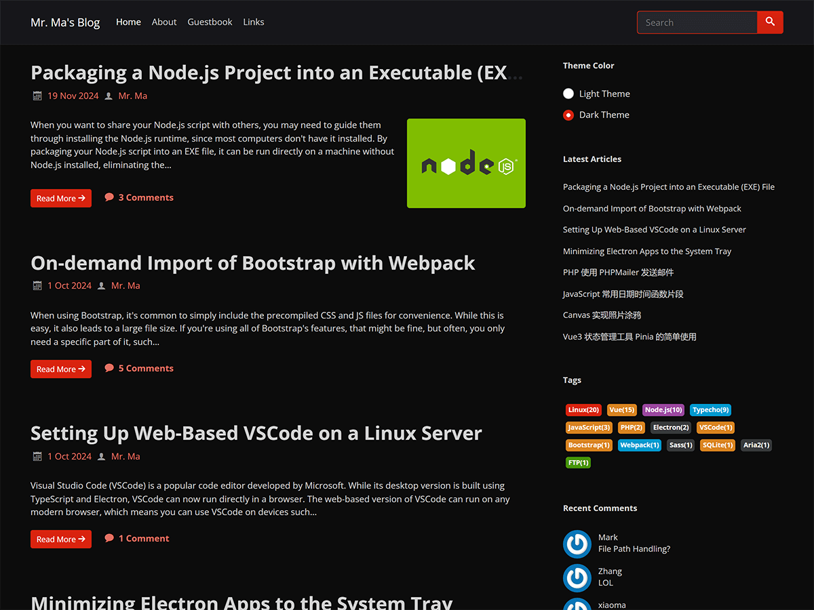

# Facile-WordPress

**English** | [简体中文](README.zh.md)

Facile is a clean and minimalist blog theme designed for both WordPress and Typecho. It is also the theme I currently use for my own blog.

You are now viewing the WordPress version of the theme. If you're looking for the Typecho version, you can find it at [https://github.com/changbin1997/Facile](https://github.com/changbin1997/Facile).

## Related Links

Theme Demo: [https://www.misterma.com/](https://www.misterma.com/)

Theme Download: [https://github.com/changbin1997/facile-wordpress/releases](https://github.com/changbin1997/facile-wordpress/releases)

## Screenshots

Light theme:

Dark theme:

Large:

## Features

* Responsive design for seamless viewing on all devices  
* Accessibility support to ensure an inclusive experience  
* Light and dark color schemes with automatic adjustment based on system settings  
* Built-in code highlighting for developers and tech enthusiasts  
* Multiple layout options for post lists  
* Extensive customization options to tailor the theme to your needs  
* Comprehensive documentation to guide you through setup and usage  
* Actively maintained for long-term reliability  

## Installation  

WordPress has strict requirements for theme development, and the theme is currently being adjusted to meet these guidelines. Once the adjustments are complete, it will be submitted to the official theme directory. For now, the theme needs to be manually downloaded and installed.  

### Method 1

1. Go to the [Releases](https://github.com/changbin1997/facile-wordpress/releases) page and download the latest version of Facile as a ZIP file.  
2. Log in to your WordPress admin panel and go to `Appearance` - `Themes`.  
3. Click `Add New Theme`, then click `Upload Theme`. Choose the downloaded ZIP file and click `Install Now`.  
4. After installation, click `Go to Themes page`. You should see the Facile theme there. Click `Activate` to enable it.

### Method 2

1. Go to the [Releases](https://github.com/changbin1997/facile-wordpress/releases) page and download the latest version of Facile as a ZIP file.  
2. Upload the theme to the `wp-content/themes` directory of your WordPress installation.  
3. Extract the Facile ZIP file. After extraction, you should see a `facile` folder.  
4. Log in to your WordPress admin panel and go to `Appearance` - `Themes`. The Facile theme should now be visible. Click `Activate` to enable it.

## Development and Dependencies

The theme utilizes the following libraries:  

* [bootswatch](https://github.com/thomaspark/bootswatch) - A collection of stylish themes for Bootstrap  
* [jQuery](https://jquery.com/) - For DOM manipulation and required by Bootstrap  
* [highlight.js](https://highlightjs.org/) - For code syntax highlighting  
* [clipboard.js](https://github.com/zenorocha/clipboard.js) - For one-click code copying  

No additional libraries are used on the PHP backend.  

The theme icons are sourced from [IcoMoon](https://icomoon.io/), a customizable icon font library. Only the icons used in the theme are included to keep it lightweight.  

## Sidebar Widgets  

Facile fully supports WordPress's built-in sidebar widgets. In addition to the default widgets, Facile introduces the following custom widgets:  

* **Facile Color Mode Switcher**: This widget allows visitors to manually switch between light and dark modes. The selected mode is saved locally via cookies, so users will see their preferred mode when they return to the site.  
* **Facile Recent Comments**: A simplified and more accessible version of the default recent comments widget, designed for better usability.  
* **Facile Tag Cloud**: A colorful tag cloud widget with improved accessibility features, offering a visually appealing and user-friendly experience.  

All custom widgets added by Facile are prefixed with "Facile" for easy identification.  

## Accessibility  

Browsing the web is simple for most people, but it can be a significant challenge for individuals with disabilities.  

Facile is designed with accessibility in mind, incorporating extensive optimizations for screen readers. It has been tested with both [NVDA](http://www.nvda-project.org/) and [VoiceOver](https://www.apple.com/accessibility/iphone/vision/), ensuring seamless compatibility on both PCs and mobile devices. The theme accurately conveys content and information for screen reader users, enabling blind users to navigate and interact with the site effectively using standard screen readers.  

Facile also fully supports keyboard navigation and meets recommended color contrast standards for an inclusive user experience.  

## Compatibility  

The theme uses minimal CSS3 features and is fully compatible with all modern browsers. For Internet Explorer, full compatibility requires IE10 or later.  

JavaScript is written in ES6. The bundled release version is fully compatible with IE, while the development version does not support Internet Explorer or older browsers.  