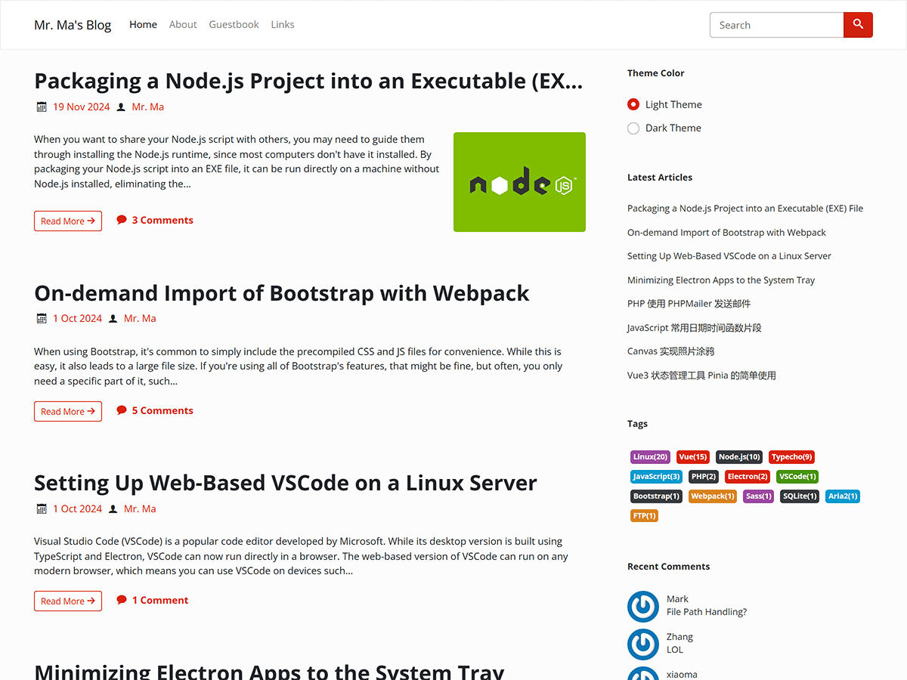

# Facile-WordPress

[English](README.md) | **简体中文**

Facile 是一套简洁的 WordPress 和 Typecho 博客主题，也是我正在使用的博客主题。

您现在看到的是 WordPress 版的主题，如果要查看 Typecho 版可以访问 [https://github.com/changbin1997/Facile](https://github.com/changbin1997/Facile) 。

## 相关链接

主题演示地址：[https://www.misterma.com/](https://www.misterma.com/)

主题下载地址：[https://github.com/changbin1997/facile-wordpress/releases](https://github.com/changbin1997/facile-wordpress/releases)

## 截图

浅色模式：

深色模式：

大头图模式：

## 特点和功能

* 响应式设计
* 无障碍适配（Accessibility）
* 包含浅色和深色两套配色（可根据系统主题配色自动调节）
* 代码高亮
* 文章列表支持多种排版方式
* 丰富的设置选项
* 详细的帮助文档
* 长期维护

## 安装

WordPress 官方的主题目录对于主题的开发要求比较严格，目前主题正在按照官方的要求调整，调整完成后会上传到官方的主题目录，现在主题还需要手动下载安装。

### 方式一

1. 进入 [Releases](https://github.com/changbin1997/facile-wordpress/releases) 下载 facile 最新版本的 zip 文件
2. 登录 WordPress 后台，进入 `外观` - `主题`
3. 点击 `安装新主题` ，点击 `上传主题` ，选择下载的主题 zip 文件，点击 `立即安装`
4. 安装完成后可以点击 `转到主题页面` ，看到 facile 主题就可以点击 `启用`

### 方式二

1. 还是一样的进入 [Releases](https://github.com/changbin1997/facile-wordpress/releases) 下载 facile 最新版本的 zip 文件
2. 把主题上传到 WordPress 目录下的 `wp-content/themes` 
3. 解压 facile 主题的 zip 文件，解压后应该能看到一个 `facile` 目录
4. 登录 WordPress 后台，进入 `外观` - `主题` ，这时应该能看到 facile 主题，点击 `启用`

## 开发和依赖

主题用到了下面几个库：

* [bootswatch](https://github.com/thomaspark/bootswatch) 不同风格的 Bootstrap 主题
* [jQuery](https://jquery.com/) DOM 操作和 Bootstrap 依赖
* [highlight.js](https://highlightjs.org/) 代码高亮
* [clipboard.js](https://github.com/zenorocha/clipboard.js) 一键拷贝代码

后端 PHP 没有用到任何库。

主题的图标使用的是 [IcoMoon](https://icomoon.io/) 的字体图标，IcoMoon 的图标可以自定义，所以主题中只包含几个用到的图标。

## 侧边栏小工具

主题完美支持 WordPress 官方的侧边栏小工具，除了官方的小工具外，Facile 还加入了下面几个小工具：

* Facile配色模式选择：配色选择小工具可以让访问的用户手动选择浅色或深色，选择的颜色会通过 Cookie 保存到本地，用户下次访问网站时，看到的就是他们选择的颜色。
* Facile最新评论：Facile加入的最新评论显示小工具相比官方的最新评论小工具要更简洁，可访问性也更好。
* Facile标签云：Facile标签云小工具可以随机生成彩色标签，在可访问性方面也要更好。

名称以 Facile 开头的就是 Facile 加入的小工具。

## 无障碍（Accessibility）

上网对于大多数人来说是一件再简单不过的事，但是对于一些身体有缺陷的残障人士来说却是一件非常困难的事。

Facile 主题针对屏幕阅读器做了大量优化，并在 [NVDA](http://www.nvda-project.org/) 和 [VoiceOver](https://www.apple.com/cn/accessibility/iphone/vision/) 这两款屏幕阅读器上做过测试，无论是 PC 还是移动设备都能完美朗读，主题能准确传达需要朗读的内容和信息，对于盲人来说，使用标准的屏幕阅读器基本可以无障碍操作。

主题可完美支持键盘访问，颜色对比度也符合标准。

## 兼容性

主题用到了少量的 CSS3，常见的浏览器都能完美兼容，IE 系列浏览器需要达到 IE10 才能完美兼容。

JavaScript 用到了 ES6，打包的发行版可以完美兼容 IE，开发版不支持 IE 系列浏览器和一些较老的浏览器。